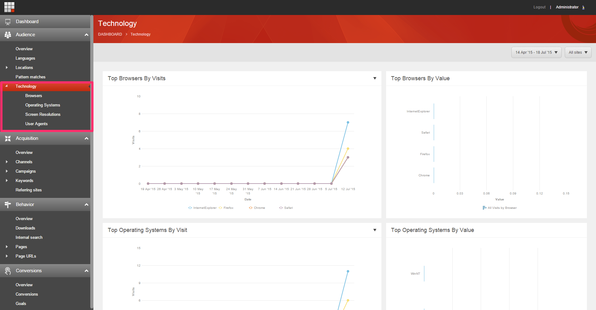

# DP.Sitecore.Analytics.Technology
Package for adding technology related data and dashboards to Sitecore's Experience Analytics

This package adds a section in Sitecore's Experience Analytics Audience tab to show technology metrics stored in xDB's Interactions collection. The dimensions are browser, OS, screen resolution and user agent strings and includes metrics such as: page views, engagement value, and visits.

The installable package can be found under: Package Files/DP.Sitecore.Analytics.Technology.zip

